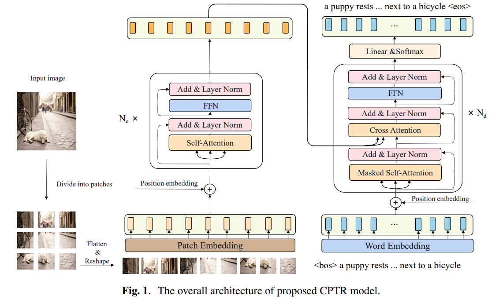
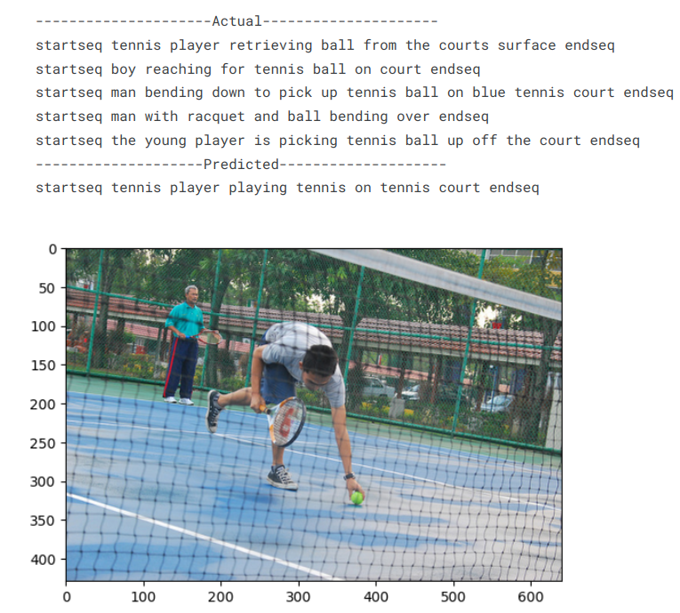
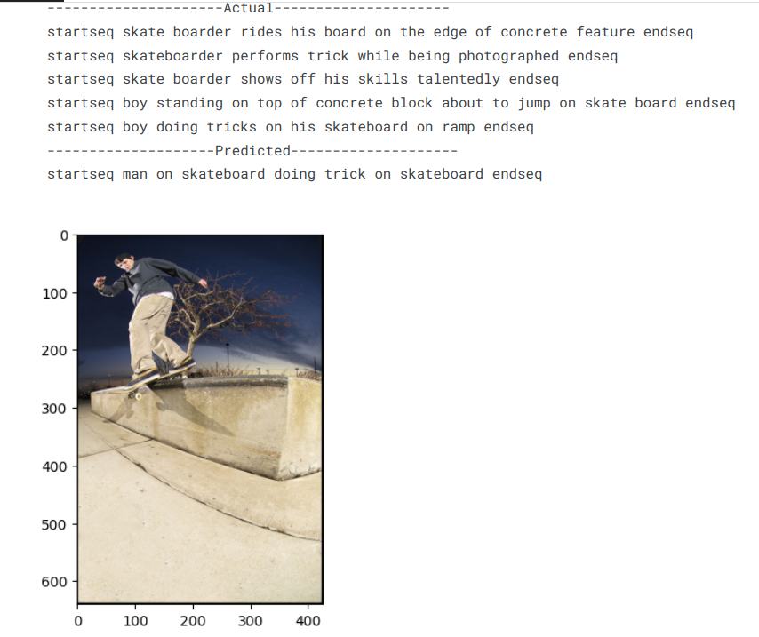
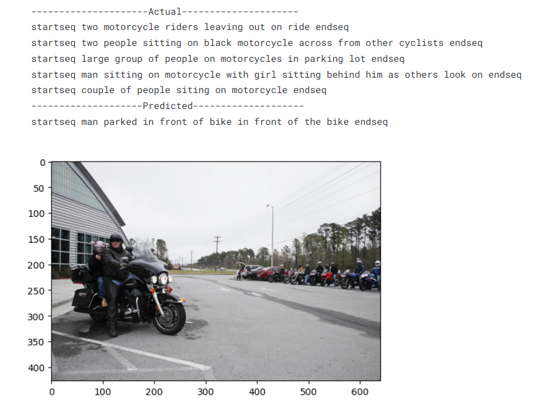
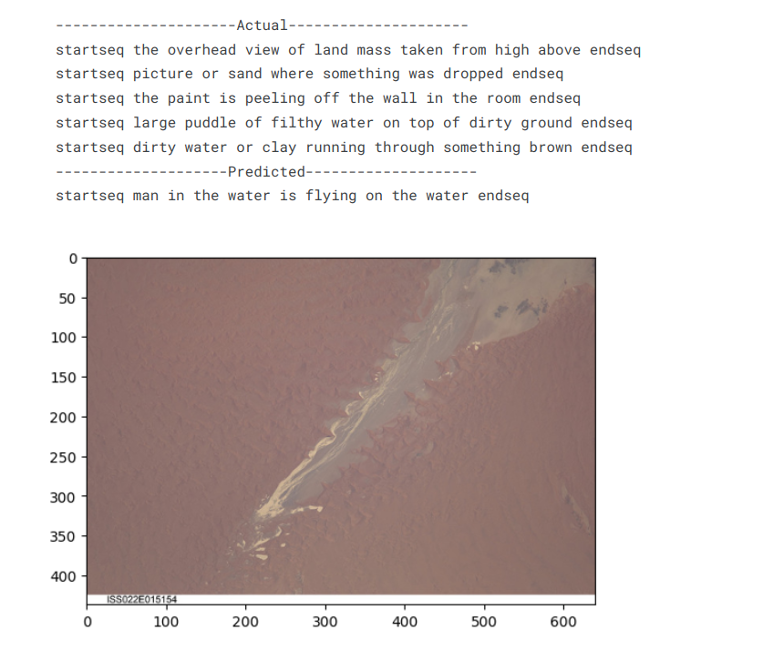

<h1 align = "center" > <strong>Vision Transformers From Scratch</strong>  </h1>

<h2 align = "center">

[SRA](https://www.sravjti.in/) Eklavya 2024 ✨ </h2>

<!-- TABLE OF CONTENTS -->
## Table of contents

- [About the project](#about-the-project)
  - [Aim](#aim)
  - [Description](#️-description)
  - [Tech Stack](#-Tech-Stack)
  - [Dataset](#Dataset)
  - [File Structure](#file-structure)
- [Getting Started](#getting-started)
  - [Installation](#-installation)
- [Theory and Approach](#theory-and-approach)
  - [CNN + LSTM Model](#cnn--lstm-model)
  - [ViT Model](#vision-transformers-model-vit)
- [Results](#results)
  - [CNN + LSTM model](#cnn--lstm-model)
  - [ViT model](#vit-model)
- [Contributors](#contributors)
- [Acknowledgements](#acknowledgements)
 

<!-- ABOUT PROJECT -->
# 🚀  About the project
## ⭐ Aim
The aim of this project is to generate descriptive captions for images by combining the power of Transformers and computer vision.

## ✏️ Description
This project focuses on image captioning using Vision Transformers (ViT), implemented from scratch. Initially, a basic CNN + LSTM approach was employed to establish a baseline. We then transitioned to a more advanced Vision Transformer (ViT) model to leverage its capability in capturing long-range dependencies in image data.

## 🤖 Tech Stack
### Programming Language
 

### Deeplearning Frameworks

### Data handling

### Natural Language Processsing

## Dataset
The project uses the [COCO 2017 dataset](https://www.kaggle.com/datasets/awsaf49/coco-2017-dataset) , a comprehensive dataset comprising of 5 descriptive captions for each image. 

## File structure

<!-- GETTING STARTED -->
# Getting started
## 🛠 Installation
1) Clone the repo 
`git clone https://github.com/sneha31415/vision_transformers_from_scratch.git`

2) Navigate to the project directory 
`cd vision_transformers_from_scratch` 

<!-- THEORY AND APPROACH -->
# Theory and Approach
## CNN + LSTM Model
This is the complete architecture of the CNN + LSTM image captioning model. The CNN encoder basically finds patterns in images and encodes it into a vector that is passed to the LSTM decoder that outputs a word at each time step to best describe the image. Upon reaching the {endseq} token or the maximum length of the sentence, the entire caption is generated and that is our output for that particular image.

#### 1) Encoder: 
A pretrained CNN model (ResNet50) is used for feature extraction, transforming input images into fixed-length feature vectors.
#### 2) Decoder: 
An LSTM network is utilized to generate captions by taking image features and previous word embeddings as input to predict the next word.

## Vision Transformers model (ViT) 
### What are transformers?
Before heading into vision transformers, lets understand transformers.  Since the introduction of transformers in the 2017 paper [Attention is all you need ](https://arxiv.org/abs/1706.03762)by Google Brain, it steered an interest in its capability in NLP
#### Transformer Architecture

<!-- 
The transformer is an architecture that relies on the concept of attention, a technique used to provide weights to different parts of an input sequence so that a better understanding of its underlying context is achieved.  
In addition, transformers process inputs in parallel making them more efficient and scalable in comparison to traditional sequential models such as RNN and LSTM. -->

**In the Transformer model:**

- Encoder: Converts input tokens into continuous representations using self-attention to capture relationships between all tokens simultaneously.
- Decoder: Generates output tokens by attending to both the encoder’s output and previously generated tokens, using masked self-attention and cross-attention.

### What are Vision Transformers?
The Vision Transformer, or ViT, is a model that employs a Transformer-like architecture over patches of the image. An image is split into fixed-size patches, each of them are then linearly embedded, position embeddings are added, and the resulting sequence of vectors is fed to a standard Transformer encoder. 

### Image Captioning using ViT

#### 1) ViT Encoder
As depicted in Fig, instead of using a pretrained CNN or
Faster R-CNN model to extract spatial features or bottom-up
features like the previous methods, we divide the original image into a sequence of image patches to adapt to the input
form of Transformer. We used a Conv2D layer(due to performance gain reasons) with a stride and kernel size equal to patch size. Alternatively you can also use linear layer here. and then reshape the 4D tensor to 3D to flatten it. Then add the learnable position embeddings. 

The encoder of CPTR consists of Ne stacked identical
layers, each of which consists of a multi-head self-attention
(MHA) sublayer followed by a positional feed-forward sublayer. MHA contains H parallel heads and each head hi corresponds to an independent scaled dot-product attention function which allows the model to jointly attend to different subspaces.

#### 2) Transformer Decoder
In the decoder side, we add positional embedding to
the word embedding features and take the addition of encoder output and decoder 1st layer results as the input.  

The decoder consists of Nd stacked identical layers with each layer containing a masked multi-head self-attention sublayer followed
by a multi-head cross attention sublayer and a feedforward sublayer sequentially.
The output feature of the last decoder layer is utilized to
predict next word via a linear layer whose output dimension
equals to the vocabulary size

## Results
### CNN + LSTM Model

#### 1) Bleu score
- The CNN + LSTM model achieved a BLEU-1 score of <u>0.553085</u> and BLEU-2 score of <u>0.333717</u> 

#### 2) Predicted Captions

#### some fails

### ViT Model

## Contributors

- [Sneha Singh](https://github.com/sneha31415) - sneha.singh.31415@gmail.com

- [Prithvi Tambewagh](https://github.com/rkt-1597) - patambewagh_b23@et.vjti.ac.in

- [Akash Kawle](https://github.com/shinymack) - ackawle_b23@et.vjti.ac.in

## Acknowledgements 
- [SRA VJTI](https://www.sravjti.in/) Eklavya 2024
  
A heartful gratitude to the mentors of this project:
- [Aryan Nanda](https://github.com/AryanNanda17)
- [Abhinav Ananthu](https://github.com/Herculoxz)
   

